# Scoop — Inline Prediction Trading Extension

> **"Trade the tweet."**  
> A Chrome extension that detects prediction market links on X (Twitter) and lets users buy or sell outcome shares without leaving the page.

[](./LICENSE)
[](https://bscscan.com)
[](https://vitejs.dev)
[](https://rizwanmoulvi.github.io/scoop/)

**[→ Landing Page](https://rizwanmoulvi.github.io/scoop/)** · [Download ZIP](https://github.com/rizwanmoulvi/scoop/archive/refs/heads/main.zip)

---

## Table of Contents

1. [Problem Statement](#problem-statement)
2. [Solution Overview](#solution-overview)
3. [User Journey](#user-journey)
4. [System Architecture](#system-architecture)
5. [Features](#features)
6. [BNB Chain Integration](#bnb-chain-integration)
7. [Tech Stack & Dependencies](#tech-stack--dependencies)
8. [Project Structure](#project-structure)
9. [Getting Started](#getting-started)
10. [Environment Configuration](#environment-configuration)
11. [Building & Loading the Extension](#building--loading-the-extension)
12. [Business Model & Roadmap](#business-model--roadmap)

---

## Problem Statement

Prediction markets exist. Twitter debates exist. The two are separated by a wall of copy-paste, tab-switching, and wallet friction.

Users argue about outcomes in real time but cannot act on their conviction until they leave the conversation, open a new tab, connect their wallet, navigate the market, and place a trade — by which time the moment has passed.

**Scoop removes that wall.**

---

## Solution Overview

Scoop is a Chrome MV3 browser extension that:

- Scans X (Twitter) posts for prediction market links (Probable.markets and others)
- Injects an inline **"Bet"** button next to detected links
- Opens a lightweight side-panel with live market data, probability, and your current on-chain position
- Lets users **buy or sell outcome shares** via EIP-712 signed CLOB orders using their existing MetaMask wallet — no proxy, no custodian, no extra accounts

All order signing and submission happens client-side. There is no backend server. Your private key never leaves MetaMask.

---

## User Journey


---

## System Architecture

```mermaid
graph TB
    subgraph Browser["Chrome Extension (MV3)"]
        direction TB

        CS["Content Script\ncontentScript.ts\n• Scans tweet DOM\n• Injects Bet button\n• Bridges eth RPC to MetaMask"]
        BG["Background Service Worker\nbackground.ts\n• Manages panel lifecycle\n• Relays messages"]
        SP["Side Panel\nReact + Zustand\n• MarketView\n• OrderForm\n• WalletConnect\n• StatusView"]
    end

    subgraph Platforms["Platform Adapters"]
        PA["ProbableAdapter\n• getMarket()\n• getOrderBook()\n• buildOrder()\n• signOrder()\n• submitOrder()\n• getOrderStatus()"]
    end

    subgraph Chain["BNB Chain Mainnet (BSC)"]
        CTF["CTF Exchange\n0xF99F5367..."]
        CTFT["CTF Token (ERC-1155)\n0x364d0505..."]
        USDT["BSC-USD (USDT)\n0x55d39832..."]
    end

    subgraph APIs["Probable.markets APIs"]
        MKT["Market API\nmarket-api.probable.markets\n• Event & market metadata"]
        OB["Orderbook API\napi.probable.markets\n• Midpoint / Bids / Asks\n• POST order\n• GET order status"]
    end

    MM["MetaMask\nEIP-712 signer\nBSC RPC"]

    CS -->|"Detect link URL"| BG
    BG -->|"Open panel"| SP
    SP -->|"buildOrder / signOrder"| PA
    PA -->|"getMarket / getOrderBook"| MKT
    PA -->|"submitOrder / getOrderStatus"| OB
    SP -->|"eth_signTypedData_v4"| MM
    MM -->|"BSC eth_call"| Chain
    SP -->|"balanceOf ERC-1155"| CTFT
    PA -->|"EIP-712 signed order"| CTF
```



**Data flow for a BUY order:**

```
User input → buildOrder() → signOrder() → EIP-712 MetaMask prompt →
signedOrder → submitOrder() → Probable CLOB API →
Order resting or filled → getOrderStatus() → UI update →
balanceOf(CTF Token) confirms on-chain position
```

---

## Features

| Feature | Status |
|---|---|
| Detect prediction market links in tweets | ✅ |
| Inject inline Bet button | ✅ |
| Live probability bar + volume | ✅ |
| Live orderbook (bids/asks/midpoint) | ✅ |
| MetaMask connect + BSC network guard | ✅ |
| EIP-712 CLOB order signing (EOA direct) | ✅ |
| One-time USDT + CTF token approvals | ✅ |
| BUY outcome shares | ✅ |
| SELL outcome shares held on-chain | ✅ |
| On-chain position display (no proxy needed) | ✅ |
| Order status polling after submission | ✅ |
| Paper trading mode (simulate without real USDT) | ✅ |
| Twitter bot (post market data to X) | ✅ |
| Multi-platform adapter architecture | ✅ (Probable live; Predict.fun / Opinion stubbed) |

---

## BNB Chain Integration

Scoop operates entirely on **BNB Smart Chain (BSC) Mainnet (chainId 56)**.

### Smart Contracts Interacted With

| Contract | Address | Purpose |
|---|---|---|
| Probable CTF Exchange | [`0xF99F5367ce708c66F0860B77B4331301A5597c86`](https://bscscan.com/address/0xF99F5367ce708c66F0860B77B4331301A5597c86) | CLOB order matching & settlement |
| CTF Token (ERC-1155) | [`0x364d05055614B506e2b9A287E4ac34167204cA83`](https://bscscan.com/address/0x364d05055614B506e2b9A287E4ac34167204cA83) | Conditional outcome tokens (YES/NO shares) |
| BSC-USD (USDT) | [`0x55d398326f99059fF775485246999027B3197955`](https://bscscan.com/address/0x55d398326f99059fF775485246999027B3197955) | Collateral for order margin |

### On-Chain Actions

- **USDT approval** for CTF Token contract (`approve MaxUint256`)
- **USDT approval** for CTF Exchange contract (`approve MaxUint256`)
- **CTF Token approval** for CTF Exchange (`setApprovalForAll`)
- **EIP-712 order signing** (`eth_signTypedData_v4`) — no gas, off-chain signature
- **Order settlement** triggered by the exchange matching engine when counterparty exists
- **Balance checks** via direct `eth_call` to `balanceOf(eoaAddress, tokenId)` on ERC-1155

### Why BSC?

- Sub-second block times and ~$0.10 gas fees make micro-trades viable
- Probable.markets is deployed natively on BSC
- USDT (BEP-20) is the dominant stablecoin collateral on the chain

---

## Tech Stack & Dependencies

### Runtime Dependencies

| Package | Version | Purpose |
|---|---|---|
| [`react`](https://reactjs.org) | ^18.3.1 | Side panel UI |
| [`react-dom`](https://reactjs.org) | ^18.3.1 | React DOM renderer |
| [`zustand`](https://github.com/pmndrs/zustand) | ^4.5.5 | Lightweight state management |
| [`ethers`](https://ethers.org) | ^6.13.4 | EIP-712 signing, ABI encoding, BSC RPC calls |

### Dev / Build Dependencies

| Package | Purpose |
|---|---|
| [`vite`](https://vitejs.dev) + [`@vitejs/plugin-react`](https://github.com/vitejs/vite-plugin-react) | Build system, HMR, MV3 bundle splitting |
| [`vite-plugin-static-copy`](https://github.com/sapphi-red/vite-plugin-static-copy) | Copy `manifest.json` and assets to `dist/` |
| [`tailwindcss`](https://tailwindcss.com) | Utility-first CSS |
| [`typescript`](https://www.typescriptlang.org) | Type safety |
| [`eslint`](https://eslint.org) + `@typescript-eslint/*` | Linting |
| [`prettier`](https://prettier.io) | Code formatting |
| [`tsx`](https://github.com/privatenumber/tsx) | Run TypeScript scripts (Twitter bot) |
| [`twitter-api-v2`](https://github.com/PLhery/node-twitter-api-v2) | Twitter bot — post market updates |
| [`dotenv`](https://github.com/motdotla/dotenv) | Environment variable loading for bot scripts |
| [`pngjs`](https://github.com/pngjs/pngjs) | Generate extension icons from source |
| [`@types/chrome`](https://github.com/DefinitelyTyped/DefinitelyTyped) | Chrome extension API types |

---

## Project Structure

```
scoop/
├── src/
│   ├── background/          # MV3 service worker
│   ├── content/             # Content script — DOM scanner, Bet button injector, Ethereum bridge
│   ├── panel/               # Side panel React app
│   │   ├── components/      # MarketView, OrderForm, WalletConnect, StatusView
│   │   ├── hooks/           # useCtfBalance (on-chain ERC-1155 balance polling)
│   │   └── store.ts         # Zustand store (wallet, market, order state)
│   ├── sidebar/             # Alternative sidebar React app (same components, different layout)
│   ├── platforms/           # Platform adapters
│   │   ├── ProbableAdapter.ts   # Full CLOB integration (buy + sell)
│   │   ├── PredictFunAdapter.ts # Architecture stub
│   │   └── OpinionAdapter.ts    # Architecture stub
│   ├── wallet/              # MetaMask proxy, approvals, network helpers
│   ├── hooks/               # Shared React hooks (useCtfBalance)
│   ├── types/               # Shared TypeScript types (market, order)
│   └── utils/               # apiFetch, helpers
├── scripts/
│   ├── check-order.mjs      # Debug: query order status + on-chain balance
│   └── generate-icons.mjs   # Generate PNG icons from source
├── bot/                     # Twitter bot (posts market updates to X)
├── public/                  # Static assets (manifest.json, icons)
├── .env.example             # Environment variable template
└── vite.config.ts           # Multi-entry Vite build (panel + sidebar + background + content)
```

---

## Getting Started

### Prerequisites

- Node.js ≥ 18
- npm ≥ 9
- Google Chrome (or any Chromium-based browser)
- MetaMask extension installed and configured for **BNB Smart Chain Mainnet**

### Install

```bash
git clone https://github.com/<your-org>/scoop.git
cd scoop
npm install
```

---

## Environment Configuration

Copy the example env file and fill in values for the Twitter bot (only needed if running the bot):

```bash
cp .env.example .env
```

```env
# Twitter Bot (optional — only for bot/bot.ts)
TWITTER_API_KEY=
TWITTER_API_SECRET=
TWITTER_ACCESS_TOKEN=
TWITTER_ACCESS_SECRET=
PROBABLE_API_KEY=
PROBABLE_API_SECRET=
PROBABLE_PASSPHRASE=
PROBABLE_EOA_ADDRESS=
```

The extension itself has **no server-side secrets**. All signing happens in MetaMask. There are no hardcoded private keys anywhere in the source.

---

## Building & Loading the Extension

### Development (watch mode)

```bash
npm run dev
```

Vite rebuilds on every file change. Reload the extension in Chrome after each build.

### Production build

```bash
npm run build
```

Output is written to `dist/`.

### Load in Chrome

1. Open `chrome://extensions`
2. Enable **Developer mode** (top right toggle)
3. Click **Load unpacked**
4. Select the `dist/` folder

### Twitter Bot (optional)

```bash
# Dry run — prints what would be posted without tweeting
npm run bot:dry

# Live run
npm run bot
```

### Debug a specific order

```bash
# Fill in EOA_ADDRESS, ORDER_ID, TOKEN_ID, and optionally API credentials at the top of the file
node scripts/check-order.mjs
```

---

## Business Model & Roadmap

### Target Users

- Crypto-native Twitter/X users who already trade prediction markets
- Traders who want to act on real-time sentiment without leaving the feed
- Anyone holding Probable positions who wants a cleaner interface

### Value Proposition to BNB Chain

Scoop brings prediction market trading surface directly into the most-used social layer in crypto. Every successful trade routes through BSC contracts, increases TVL in the Probable CTF Exchange, and generates fee revenue for the ecosystem.

### Revenue Model

- **Fee-on-top**: A small maker/taker spread (e.g. 5–10 bps) can be captured at the order construction layer without breaking the Probable fee structure
- **Premium features**: Portfolio view, alerts, multi-market tracking
- **White-label API**: Other Twitter-adjacent apps integrating the order-signing SDK

### Roadmap

#### ✅ Shipped

| Milestone | Status |
|---|---|
| **v0.1** — Probable BUY/SELL live on BSC Mainnet | ✅ Done |
| Inline Bet button injected into X feed | ✅ Done |
| On-chain CTF share balance display | ✅ Done |
| EIP-712 CLOB order signing via MetaMask | ✅ Done |

#### 🔜 Coming Soon

| Milestone | Timeline |
|---|---|
| **Comment-to-Bet Bot** — Reply `@scoop_bet YES $25` to any prediction market tweet; bot signs and submits the order, replies with fill confirmation | Q2 2026 |
| **Multi-Market Panel** — Detect multiple Probable links in one post, show a tabbed/card panel, support batch order submission and per-thread P&L | Q2 2026 |
| Open orders list + cancel from panel | Q2 2026 |

#### 🌐 Next Up — Multi-Platform Support

Scoop's content-script architecture makes each new platform a detector plugin. Planned targets:

| Platform | Notes |
|---|---|
| **X / Twitter** | ✅ Live |
| **LinkedIn** | Prediction market links in professional posts |
| **YouTube** | Bet buttons on video descriptions and comments |
| **Instagram** | Link-in-bio and story link detection |
| **Farcaster** | Native Web3 social — first-class integration |

#### 🔭 Further Out

| Milestone | Timeline |
|---|---|
| **v0.4** — Portfolio dashboard with realized / unrealized PnL | Q3 2026 |
| **v0.5** — Push notifications on order fill or market resolution | Q3 2026 |
| **v0.6** — Limit orders & advanced order types | Q3 2026 |
| **v1.0** — Multi-chain support (Polygon, Base, Arbitrum) + opBNB L2 | Q4 2026 |
| **v1.x** — Mobile companion app (iOS / Android) | 2027 |

---

## License

MIT — see [LICENSE](./LICENSE).

Scoop is open source and forkable. Contributions welcome.
